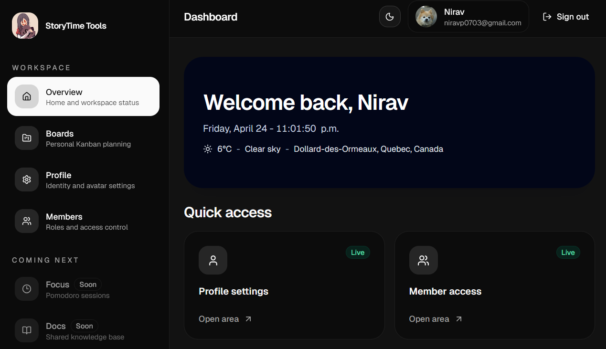

# StoryTime Tools

<p align="center">
  
</p>

<p align="center">
  <a href="https://github.com/StoryTime-Productions/st-tools/actions/workflows/deploy.yml"></a>
  <a href="https://codecov.io/gh/StoryTime-Productions/st-tools"></a>
  
  
</p>

Internal productivity web app for the StoryTime Productions team.

## Live App

Internal tool, not publicly accessible. Deployed to Vercel: see [Deployment Environments](#deployment-environments) below.

## Tech Stack

- Next.js 16 (App Router) + TypeScript
- Tailwind CSS + shadcn/ui
- Supabase (PostgreSQL) for database, auth, and realtime
- Prisma ORM
- TipTap (rich text editor)
- dnd-kit (drag & drop)
- FullCalendar
- TanStack Query (server state) + Zustand (client state)
- Deployment: Vercel

## Getting Started

### Prerequisites

- Node.js 20+
- pnpm (`npm install -g pnpm`)
- Docker Desktop (for local PostgreSQL)
- A [Supabase](https://supabase.com) project

### Setup

```bash
# 1. Clone and install
git clone https://github.com/StoryTime-Productions/st-tools.git
cd st-tools
pnpm install

# 2. Set up environment
cp .env.example .env
# For local development, keep the local Supabase values and refresh the keys with:
# pnpm supabase:start
# pnpm supabase:status

# 3. Start local Supabase stack
pnpm supabase:start

# 4. Apply Prisma migrations to the local Supabase database
pnpm prisma migrate deploy

# 5. Run development server
pnpm dev
```

Open [http://localhost:3000](http://localhost:3000).

If you already had a stale local Supabase database, stop the stack, remove the containers/volumes from Docker Desktop, then start again:

```bash
pnpm supabase:stop
pnpm supabase:start
pnpm prisma migrate deploy
```

**Local auth**: local development uses the Supabase CLI stack, including local Auth on `http://127.0.0.1:54321` and the local database on `127.0.0.1:54322`.

- Email/password sign-up works locally when `.env` uses the local Supabase URL and publishable key.
- Google OAuth is optional for local work and does not need to be configured.
- `docker-compose.yml` still provides a raw Postgres container, but that alone is not enough for the app's auth flow.

### Scripts

| Command               | Description              |
| --------------------- | ------------------------ |
| `pnpm dev`            | Start dev server         |
| `pnpm build`          | Production build         |
| `pnpm lint`           | ESLint (zero warnings)   |
| `pnpm format`         | Prettier write           |
| `pnpm format:check`   | Prettier check           |
| `pnpm typecheck`      | TypeScript type check    |
| `pnpm test`           | Vitest watch mode        |
| `pnpm test:ci`        | Vitest run + coverage    |
| `pnpm db:migrate`     | Run Prisma migrations    |
| `pnpm db:studio`      | Open Prisma Studio       |
| `pnpm db:local:up`    | Start local DB (Docker)  |
| `pnpm db:local:down`  | Stop local DB (Docker)   |
| `pnpm db:local:logs`  | Tail local DB logs       |
| `pnpm db:local:reset` | Recreate local DB volume |

## CI/CD

GitHub Actions workflows (`.github/workflows/`):

- `validate.yml`, `quality.yml`, `test.yml`: run on pull requests (linting, formatting, type checks, tests)
- `deploy.yml`: deploys to production on push to `master`/`main`
- `preview-deploy.yml`: deploys preview environments for pull requests

Two separate Supabase projects are used to isolate production from preview:

| Environment    | Trigger                     | Database                    |
| -------------- | --------------------------- | --------------------------- |
| **Production** | Push to `master`/`main`     | Production Supabase project |
| **Preview**    | Pull request opened/updated | Preview Supabase project    |

Migrations run automatically via GitHub Actions before each deploy.

### Required external setup

1. Create two Supabase projects: one for production, one for preview.
2. Add production credentials as Vercel **Production** environment variables and as GitHub Actions secrets (`DATABASE_URL`, `DIRECT_URL`).
3. Add preview credentials as Vercel **Preview** environment variables using the same names as production (`DATABASE_URL`, `DIRECT_URL`).
   Add the same preview values as GitHub Actions secrets (`PREVIEW_DATABASE_URL`, `PREVIEW_DIRECT_URL`) for the migration workflow.
4. Add `VERCEL_TOKEN`, `VERCEL_ORG_ID`, and `VERCEL_PROJECT_ID` as GitHub Actions secrets.
5. Add allowed redirect URLs for each Supabase project (production URL and Vercel preview URL pattern).
6. Enable Google under Supabase Auth > Providers for both production and preview projects.

## Contributing

Use issue-linked branches and conventional commits for all contributions.

All contributions must:

- Be linked to an existing GitHub issue
- Follow `<type>/<issue-number>-<description>` branch naming
- Use [Conventional Commits](https://www.conventionalcommits.org/en/v1.0.0-beta.4/) with a `Refs: #N` or `Closes: #N` footer
- Pass all three CI checks: `validate`, `quality`, `test`

## License

Proprietary: internal StoryTime Productions tool (`package.json` is marked `"private": true`). Not licensed for external use.
